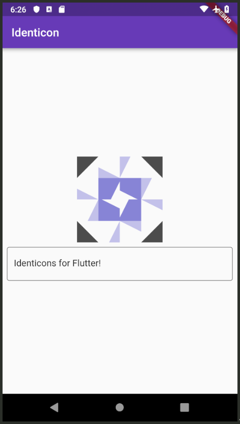

# jdenticon-flutter
[](https://pub.dartlang.org/packages/jdenticon_flutter)

Flutter widget wrapper for [jdenticons-dart](https://github.com/videah/jdenticon-dart)



## Example
```dart
class TestIdenticonPage extends StatefulWidget {
  @override
  TestIdenticonPageState createState() => TestIdenticonPageState();
}

class TestIdenticonPageState extends State<TestIdenticonPage> {
  String text = "";

  @override
  Widget build(BuildContext context) {
    return Scaffold(
      appBar: AppBar(
        title: Text("Identicon"),
      ),
      body: Center(
        child: Column(
          mainAxisAlignment: MainAxisAlignment.center,
          children: <Widget>[
            Container(
              width: 150,
              height: 150,
              child: Identicon(text),
            ),
            Padding(
              padding: const EdgeInsets.all(8.0),
              child: TextField(
                decoration: InputDecoration(border: OutlineInputBorder()),
                onChanged: (value) {
                  setState(
                    () {
                      text = value;
                    },
                  );
                },
              ),
            )
          ],
        ),
      ),
    );
  }
}
```